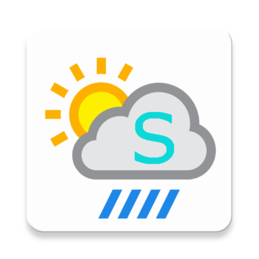

# 🌤️ Simple Weather

**Simple Weather** е модерно, стилно и бързо Android приложение за прогноза за времето, написано на **Kotlin** и **AndroidX**, с елегантен **Glassmorphism UI** дизайн, автоматична GPS локация, глобално търсене на градове, почасова и 7-дневна прогноза, и 100% български интерфейс.

[](https://github.com/Stoyan377/SimpleWeather/releases/tag/v1.0.0)
[](https://kotlinlang.org/)
[](https://developer.android.com/jetpack/androidx)
[](LICENSE)

---

## ✨ Основни Характеристики (Features)

- 🔍 **Глобално Търсене на Градове**: Търсене на прогноза за всеки град по света с автоматичен превод и кирилизация на имената.
- 📍 **Автоматична GPS Локация**: Автоматично откриване и показване на текущото местоположение при отваряне на приложението.
- 🔖 **Бързи Бутони за Любими Градове**: Бърз избор с едно докосване за **София**, **Пловдив**, **Варна**, **Бургас** и **Шабла**.
- 🕒 **Почасова Прогноза (24 часа)**: Модерен изскачащ прозорец (BottomSheet) с тъмен Glassmorphism стил, показващ детален почасов график на времето.
- 📅 **7-Дневна Прогноза**: Подробна седмична прогноза с минимални и максимални температури за всеки ден.
- ❌ **Удобен Бутон за Затваряне (✕)**: Лесно затваряне на изскачащите прозорци за прогноза с един клик.
- ⌨️ **Автоматично Скриване на Клавиатурата**: При натискане извън полето за търсене, андроид клавиатурата се скрива автоматично.
- 🔄 **Запазване на Състоянието при Завъртане**: При промяна на ориентацията (Portrait / Landscape) избраният град и мерна единица не се рестартират.
- 📱 **Пълна Поддръжка на Хоризонтален Режим (Landscape)**: Красив двуколонен интерфейс за таблети и хоризонтални екрани.
- 🎨 **Glassmorphism & Динамични Фонове**: Полупрозрачни стъклени карти и динамични фонови градиенти според метеорологичните условия (Слънчево, Нощ, Облачно, Дъжд, Сняг, Гръмотевична буря).
- 🌡️ **Превключване на Мерни Единици (°C / °F)**: Бърза смяна между Целзий и Фаренхайт.
- 📊 **Подробни Показатели за Времето**:
  - Моментална температура и усещане (*Feels like*)
  - Минимална и максимална дневна температура
  - Влажност на въздуха (%)
  - Атмосферно налягане (hPa)
  - Скорост на вятъра (m/s)
  - Точни часове на изгрев и залез
- 🌐 **Open-Meteo API Integration**: 100% безплатен, бърз и надежден източник на данни без нужда от API ключове.
- 🇧🇬 **Пълна Българска Локализация**: Всички наименования, бутони, описания и съобщения са на български език.

---

## 📸 Скрийншот (Screenshot)

<p align="center">
  
</p>

---

## 📲 Изтегляне (Download APK)

Можете да изтеглите готовия **APK** файл директно от секцията [Releases](https://github.com/Stoyan377/SimpleWeather/releases/tag/v1.0.0):

➡️ [**Изтегли SimpleWeather-v1.0.apk**](https://github.com/Stoyan377/SimpleWeather/releases/download/v1.0.0/SimpleWeather-v1.0.apk)

---

## 🛠️ Технологичен Стек (Tech Stack)

- **Език**: Kotlin 1.8.20
- **Архитектура**: Clean Repository Pattern + Background Executors & Main Looper Handler
- **UI Framework**: AndroidX, Material Design 3, Glassmorphism Drawables
- **Weather Provider**: Open-Meteo REST API & Geocoding API (`language=bg`)
- **Минимална версия на Android**: Android 5.0 (API 21+)
- **Целева версия на Android**: Android 13 (API 33)

---

## 🚀 Сглобяване от изходен код (Build Instructions)

1. Клонирайте хранилището:
   ```bash
   git clone https://github.com/Stoyan377/SimpleWeather.git
   cd SimpleWeather
   ```
2. Отворете проекта в **Android Studio**.
3. Изпълнете **Sync Project with Gradle Files**.
4. Сглобете или стартирайте приложението:
   ```bash
   ./gradlew assembleDebug
   ```
